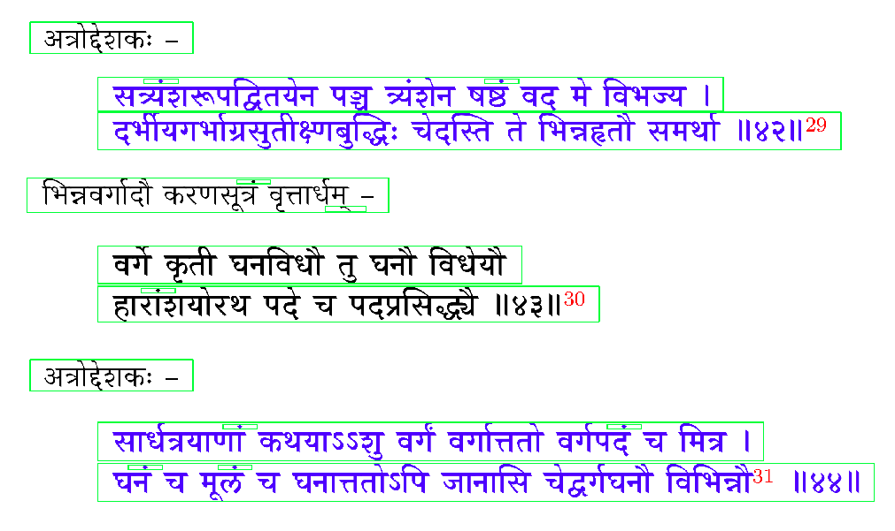

### Text Line Image Extractor

This is a simple tool to extract text line images from a PDF file. Just change the path to the PDF file in the `main.py` file and run it. The extracted images will be saved in each page's `page_i` folder. A `result.json` file would also be creating with all of the bounding box coordinates of each text line.


#### Requirements

OpenCV and PDF2Image Libraries are required to run this tool. You can install them using the following commands:

```bash
pip install opencv-python
pip install pdf2image
```


